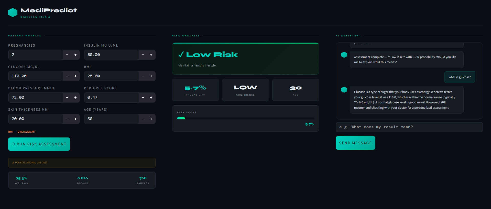
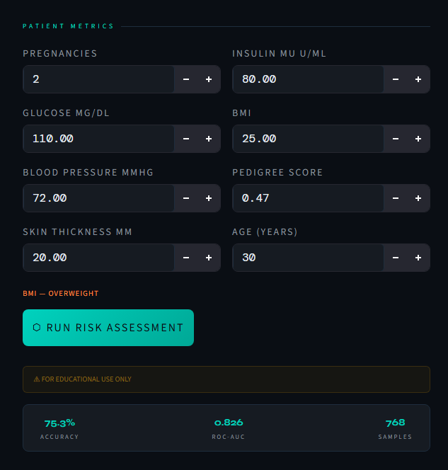
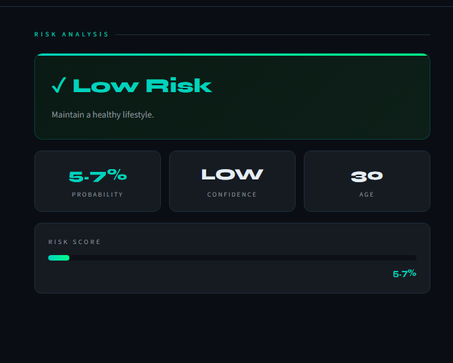
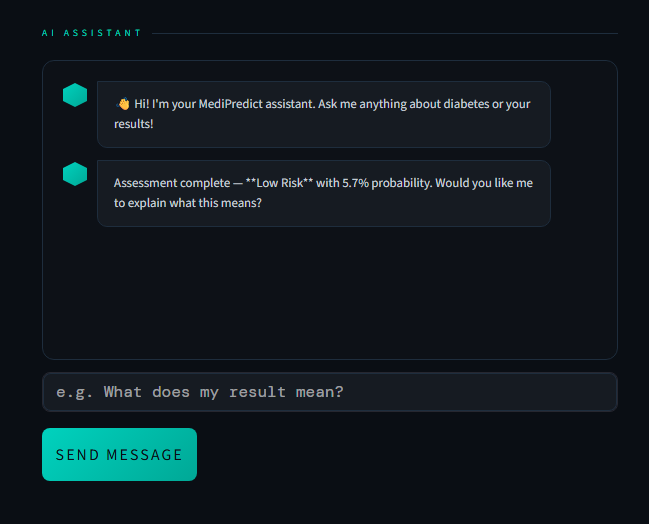
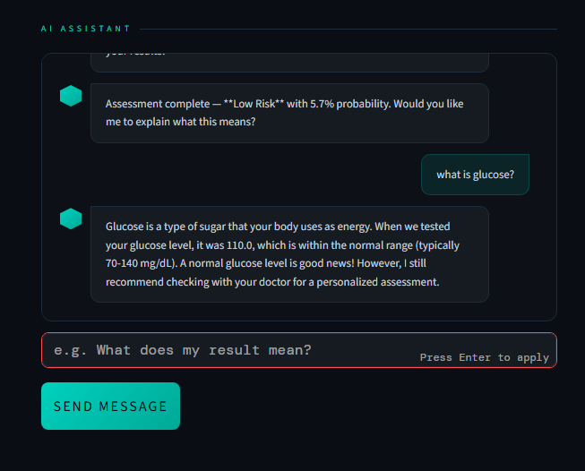

# 🩺 MediPredict - Diabetes Risk Predictor

> An end-to-end Machine Learning web application that predicts diabetes risk from patient health metrics, powered by a Random Forest model with a beautiful dark dashboard UI and an AI-powered medical chatbot.

[](https://huggingface.co/spaces/thorrwho/diabetes-risk-predictor)
[](https://github.com/thorrwho/diabetes-risk-predictor)


---

## 🌐 Live Demo

👉 **[Try it here → huggingface.co/spaces/thorrwho/diabetes-risk-predictor](https://huggingface.co/spaces/thorrwho/diabetes-risk-predictor)**

---

## 📸 Screenshots
### UI 


### Patient Metrics


### Risk Analysis


### AI Assistant  



---

## ✨ Features

- 🤖 **AI Risk Prediction** — Random Forest classifier trained on 768 real patient records
- 💬 **Medical AI Chatbot** — Powered by Llama 3.1 (Groq) for real-time medical Q&A
- 🎨 **Professional Dark UI** — Custom 3-column dashboard with teal/amber accents
- 🔌 **REST API** — FastAPI backend with auto-generated Swagger documentation
- 🐳 **Docker Ready** — Fully containerized for production deployment
- 📊 **Real-time Results** — Instant risk probability with confidence scoring

---

## 🧠 Model Performance

| Metric | Score |
|--------|-------|
| Accuracy | 75.3% |
| ROC-AUC | 0.826 |
| Precision (Diabetes) | 0.63 |
| Recall (Diabetes) | 0.70 |

---

## 🗂️ Project Structure

```
diabetes-risk-predictor/
├── app/
│   ├── __init__.py
│   ├── main.py              # FastAPI backend
│   └── streamlit_app.py     # Streamlit UI (local)
├── data/
│   └── diabetes.csv         # Pima Indians Diabetes Dataset
├── app.py                   # Standalone app (HuggingFace deployment)
├── train_model.py           # Model training script
├── Dockerfile               # Docker configuration
├── requirements.txt         # Python dependencies
└── README.md
```

---

## 🚀 Run Locally

### 1. Clone the repo
```bash
git clone https://github.com/thorrwho/diabetes-risk-predictor
cd diabetes-risk-predictor
```

### 2. Install dependencies
```bash
pip install -r requirements.txt
```

### 3. Train the model
```bash
python train_model.py
```

### 4. Start the API (Terminal 1)
```bash
uvicorn app.main:app --reload
```
API docs at: **http://localhost:8000/docs**

### 5. Launch the UI (Terminal 2)
```bash
streamlit run app/streamlit_app.py
```
App at: **http://localhost:8501**

---

## 🐳 Docker

```bash
# Build
docker build -t diabetes-app .

# Run
docker run -p 8000:8000 diabetes-app
```

---

## 🔌 API Reference

### `POST /predict`

**Request:**
```json
{
  "pregnancies": 6,
  "glucose": 148,
  "blood_pressure": 72,
  "skin_thickness": 35,
  "insulin": 100,
  "bmi": 33.6,
  "diabetes_pedigree": 0.627,
  "age": 50
}
```

**Response:**
```json
{
  "risk_label": "High Risk",
  "risk_probability": 0.82,
  "advice": "Please consult a doctor immediately."
}
```

---

## 🛠️ Tech Stack

| Layer | Technology |
|-------|-----------|
| ML Model | Scikit-learn (Random Forest) |
| API | FastAPI + Uvicorn |
| Frontend | Streamlit |
| AI Chatbot | Groq (Llama 3.1) |
| Container | Docker |
| Deployment | HuggingFace Spaces |

---

## 📚 Dataset

[Pima Indians Diabetes Database](https://www.kaggle.com/datasets/uciml/pima-indians-diabetes-database) — Originally from the National Institute of Diabetes and Digestive and Kidney Diseases. Contains 768 records with 8 health features.

---

## ⚠️ Disclaimer

This tool is for **educational purposes only** and is NOT a substitute for professional medical advice, diagnosis, or treatment. Always consult a qualified healthcare provider.

---

## 👤 Author

**Tharini Naveen**
[](https://github.com/thorrwho)
